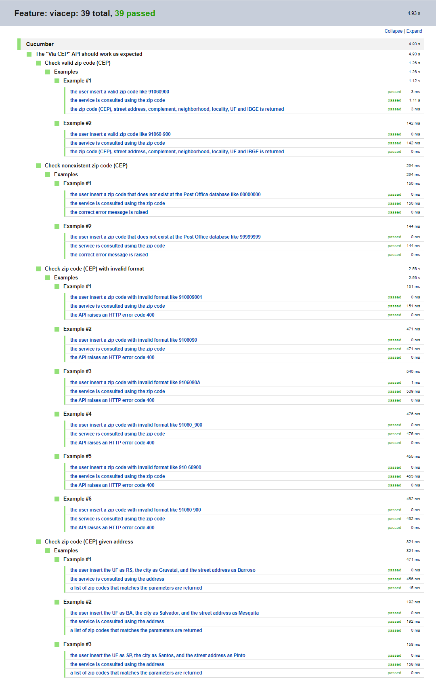
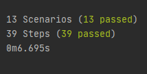

# 👨‍💻 QA Java and Cucumber Via CEP API Challenge

<div align="center">
  
</div>
<br>

Test Automation of the [Via CEP API](https://viacep.com.br/) using Java and Cucumber.

The features of the tests are inside `src/test/resources/viacep/viacep.feature` and the step definitions are inside `src/test/java/viacep/StepDefinitions.java`

## 📅 Test execution report

- [Link to test execution report](Test_Results_Feature_viacep.html)

## 💾 Development Dependencies Used

- "Apahce Maven": "3.6.3"
- "Java":  " 11.0.9.1"
- "Cucumber": "6.10.4"
- "Chrome Driver": "90.0.4430.24"
- "Google Chrome": "90.0.4430.212"

## 🎬 Getting Started

1. Clone the project into your machine, install all dependencies described above and compile the project using:

```console
mvn compile
```

2. Now, to run the tests:

```console
mvn test
```

3. Verify the tests results output:



---

Made with ❤️ by Matheus Beck 👋 [Get in touch!](https://www.linkedin.com/in/matheus-beck/)
